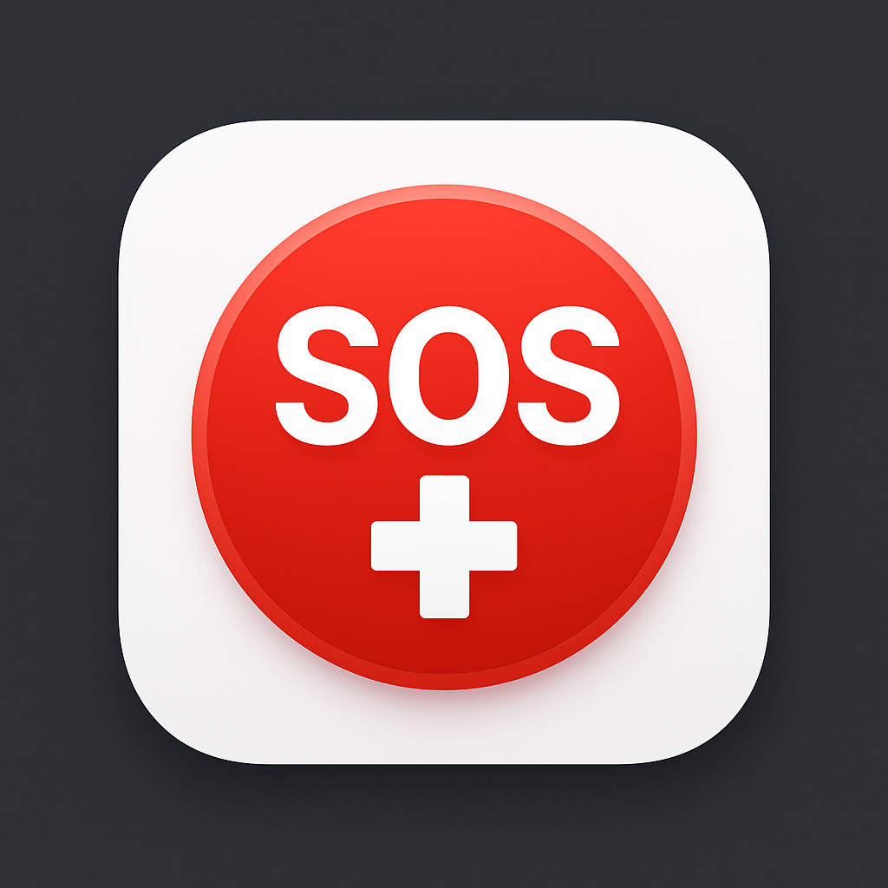

#  LifeLink 

💡 Because every second counts in a medical emergency.

LifeLink is an Android application built in Kotlin that creates a mesh network using Bluetooth and the Internet to share urgent medical issues — even when traditional connectivity fails.

Imagine being able to send a medical SOS that hops from one phone to another until it reaches someone who can help. That’s what LifeLink does.

🚀 How It Works

🔹 Mesh Networking – Devices connect with each other via Bluetooth to form a local network.
🔹 Internet Bridge – If at least one device has internet, the whole mesh can sync outward.
🔹 Medical Alerts – Users can send issues like injury, heart attack, accident, or health emergency.
🔹 Hop-by-Hop Delivery – If the recipient is out of range, the message travels through nearby phones until delivered.

📌 Problem Statement

In medical emergencies, time is life. Yet:
Internet and mobile networks may fail in disasters, rural areas, or crowded events.
Critical SOS alerts often don’t reach responders fast enough.
People nearby (who could help) remain unaware of the emergency.

💡 Solution

LifeLink ensures no one is ever truly disconnected.
Uses Bluetooth mesh to create offline networks.
Uses internet (if available) to expand reach.
Sends medical issues + location details to nearby users and emergency responders.
Bridges the gap between patients, bystanders, and healthcare providers.

🌟 Key Features

📱 Offline SOS Messaging (Bluetooth Mesh)

🌍 Internet Sync (if available, for global delivery)

🆘 Medical Issue Templates (Quick-select emergencies: Heart, Accident, etc.)

📍 Location Sharing with alerts

🔒 Secure & Reliable delivery

🛠️ Tech Stack

Language: Kotlin

Framework: Android SDK + Jetpack Components

Networking: Bluetooth Mesh + Internet Fallback

Database: Room (SQLite)

Backend (optional): Firebase / REST API

Libraries: Retrofit, Coroutines, ViewModel, LiveData

📊 Impact

🕑 Reduces emergency response time by alerting nearby people instantly.

🌐 Works offline, useful in remote villages, disaster zones, or crowded events.

💙 Empowers communities to help each other before professional help arrives.

🚧 Future Scope

🌐 Multi-language support for accessibility.

⌚ Wearable device integration (smartwatches, bands).

🤖 AI-powered triage: auto-prioritize medical issues.

🛰️ Satellite connectivity for extreme scenarios.

🤝 Authors

👤 Abhishek Allipur

👤 Rathan Deep

👤 Ameet s

📜 License

This project is licensed under the MIT License.
